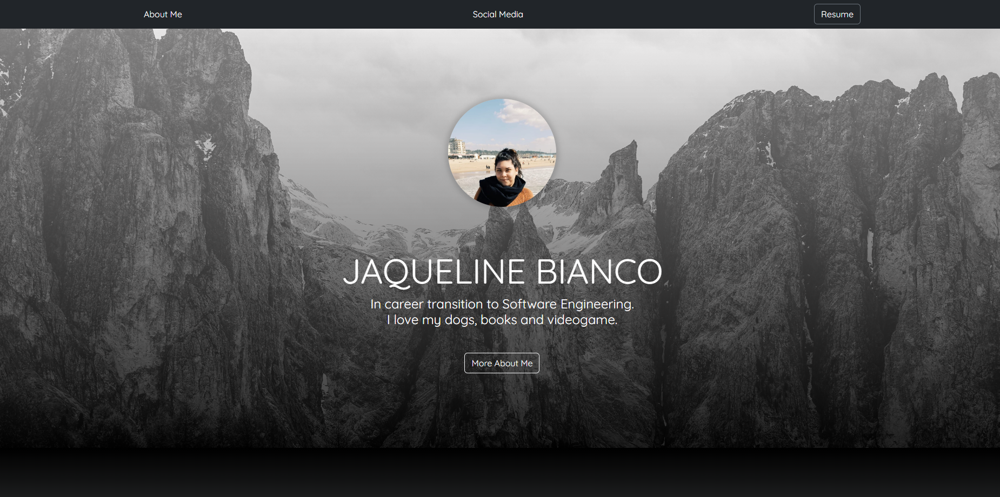
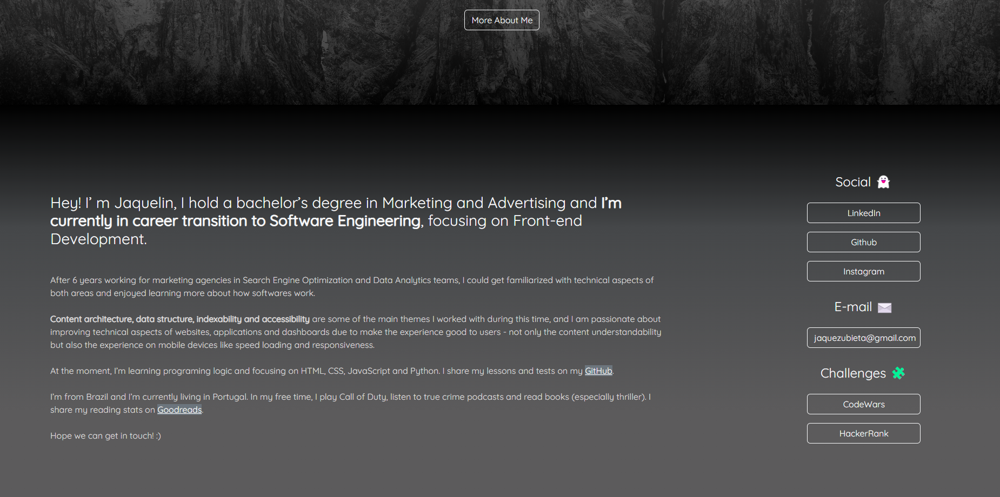

# **jaquezux.github.io**

This is my personal website. It's my first project exploring Bootstrap framework.  
Here you can find more about my professional background as SEO and Data Analyst in Marketing agencies.  
You can also access my Social Media shortcuts :)
#
👾 **Technologies used:**   
- HTML
- CSS
- Bootstrap
#

📜 **Main Learnings:**

_HTML_:
- How to call Bootstrap in header.
- How to apply scroll trigger on links.

_CSS_:
- How to use linear-gradient.
- Display flex and flex direction.

_BOOTSTRAP_:
- How to explore and combine style options.
- How to use container, columns e margins.
#

## **Screenshots** ##
 
 

#
I'm very interested in receive improvement suggestions for this project, so feel free to reach me! :)